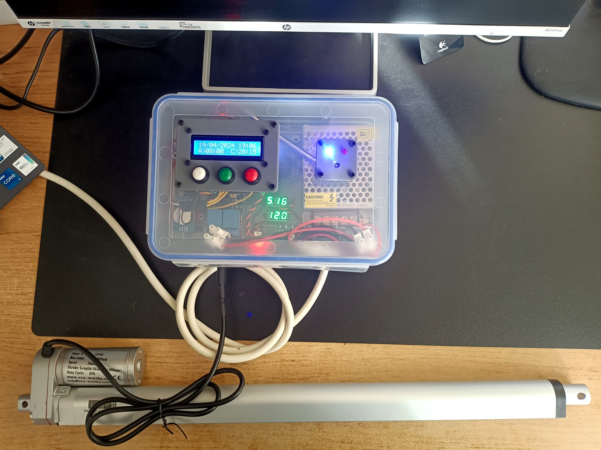
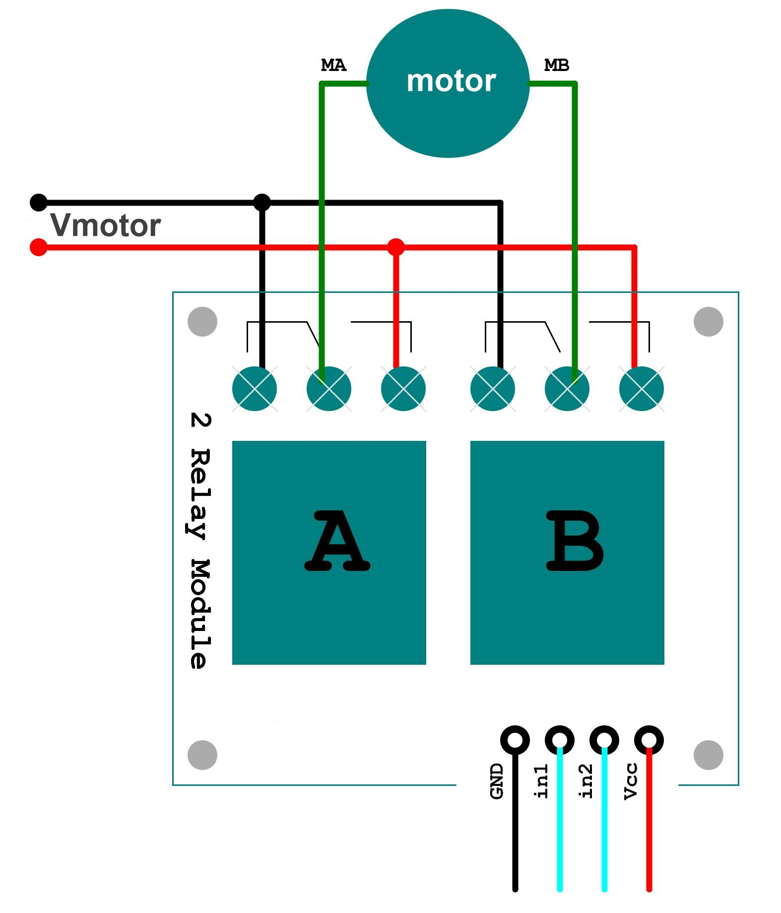
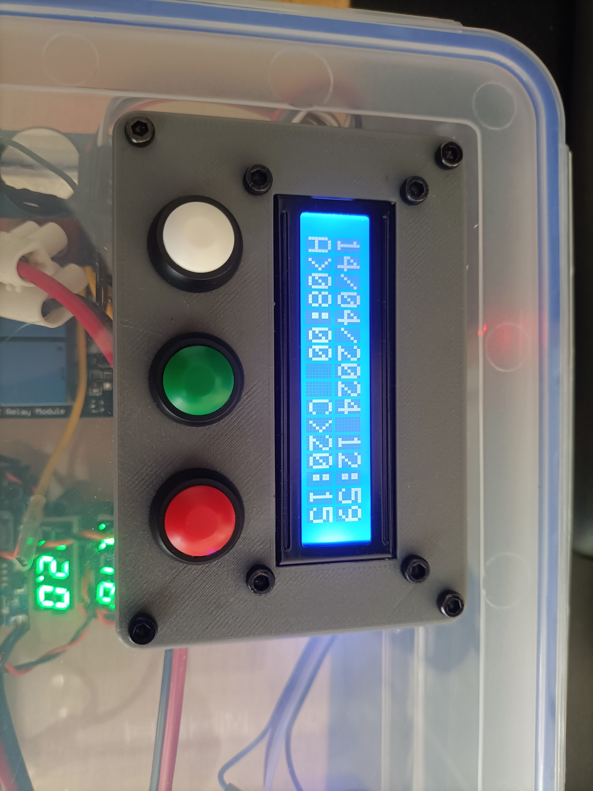
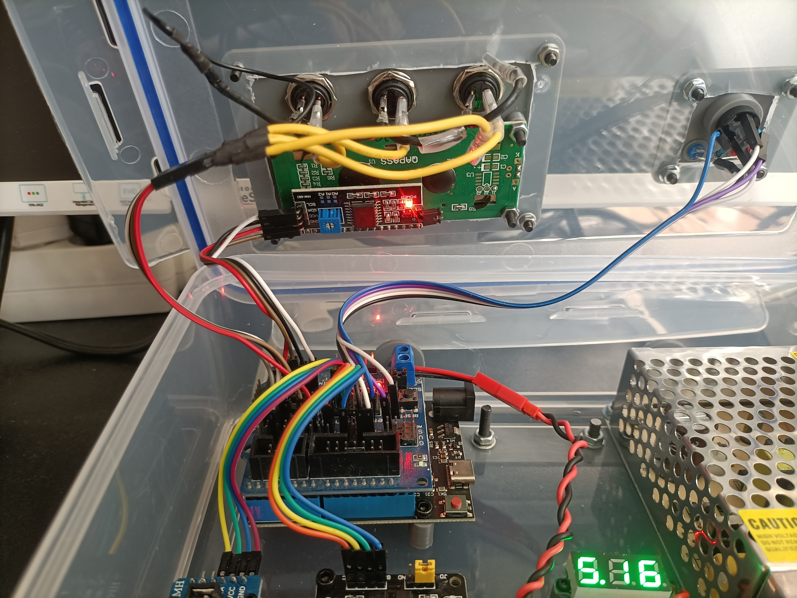

# automatic_henhouse
Little personal project to automate a henhouse door using Arduino.

## Description

In this project I am looking to automate a trap door so that the hens in my chicken coop can go out to graze in the morning and that it closes automatically at night when they go back to sleep.
For this I want it to operate at the specified time, that I can easily change the opening and closing time and that I can actuate the trap door manually. It must also be safe for the hens, without hurting them in case of entrapment.

For this I used an Arduino that implements a state machine, an electric cylinder that opens and closes the door, driven by a double relay that performs an H-bridge. With an LCD display and some buttons an interface is implemented that allows to change the time in a simple way, and to activate or deactivate the automatic mode.

The door can be opened and closed manually by means of the open (green) or close (red) button. While the door is moving, the buzzer sounds, and the led lights indicate the status of the door.

## Components 

The hardware components I have used to carry it out are:

- Arduino UNO
- DS3231 clock
- Double relay
- Buck LM2596 converter
- Three 12 mm pushbuttons
- Two LED lights: one blue and one red
- One buzzer
- One 4 Amp fuse and a fuse connector
- Barrel jack connectors.
- 12 V power supply
- Electric cylinder actuator

Here are some of the pieces I have designed in 3D for this project:
- [LCD mount](https://www.thingiverse.com/thing:6580499)
- [Arduino mount](https://www.thingiverse.com/thing:6578697)

## Hardware implementation

Here is the [wiring diagram](images/automatic_henhouse_schematic.pdf).

### Power supply 

This project uses a wide variety of components that require different voltage levels to operate. While the electric cylinder uses 12V, at a nominal current of 0.7A, the microcontroller with all the electronic components operate at 5V and small currents.

To power these elements I started with a 12V-5A power supply (certainly overdimensioned in power for the real needs of the project, I know) and used a LM2596 buck converter to obtain a 5V output.

I recommend the use of a buck converter instead of a regulated power supply to reduce from 12V to 5V due to the higher efficiency and especially the temperature difference. In regulated supplies the voltage is reduced by dissipating energy in the form of heat, which can be detrimental to the rest of the components and power efficiency.

I also placed a 4 amp relay as a protection mechanism, either in case of a motor jam (in which case the current demanded would increase drastically, and could burn the motor itself), or in case of a short circuit (it will be placed outdoors, it could get wet) or any other mishap.

### H-Bridge 

In this project I used a linear actuator with a 12 V electric motor to move the door. To drive this motor there are several solutions available, either by using drivers, transistors or relays. 

In my case I chose to use a double relay module, in which by means of some specific connections an H-bridge can be obtained that allows to feed both polarities to drive the motor in two directions, allowing to open and close the door.

Below I attach an image of the assembly that I have made to implement the H-bridge.

Image source and H Bridge with relay explanation via Instructables: https://www.instructables.com/DC-Motor-Controller-With-Two-Relay/

### LCD control panel

I made the control panel using three push buttons and a 16x2 LCD panel.
The panel I used has an I2C driver that simplifies the assembly by using only four wires, so I recommend using a similar one.

I integrated the parts into the automation box using a [3D printed panel part](https://www.thingiverse.com/thing:6580499), connecting each button to an input terminal of the Arduino.

In this case, the input buttons should be connected by a pull-up resistor (or pull-down, depending on how you prefer to make the assembly), avoiding that the Arduino terminals can be in a high impedance state while the button is not actuated. In the [wiring diagram](images/automatic_henhouse_schematic.pdf) you can see how these pins are mounted.

In my case, to simplify the assembly, I used directly the Arduino's internal pull-up resistors, whose configuration can be done in a simple way by initializing the input terminal as `pinMode(buttonPin, INPUT_PULLUP);`.

Here are some images of the panel and its internal wiring.

### Other parts

To Do ...

## Software implementation 

### FSM

To Do ...
